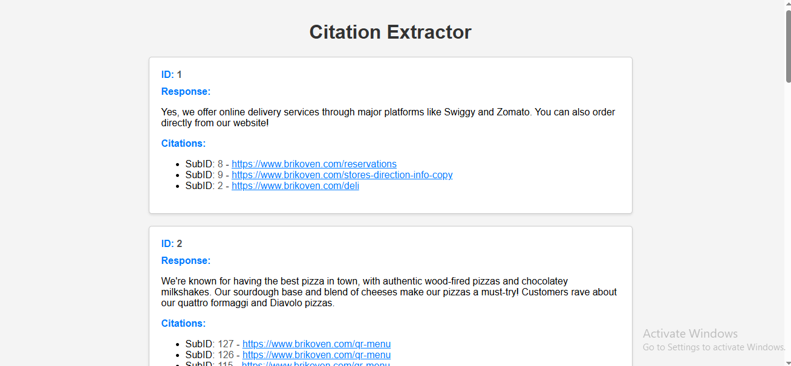

# Citation Extractor

## Overview
Citation Extractor is a simple web application that fetches citations from an API and displays them on a webpage. It retrieves data from a specified API endpoint and organizes it to showcase citations along with their associated IDs and subIDs.

## Features
- Fetches citations from an API endpoint
- Displays citations along with their IDs, subIDs and links
- Attractive and responsive user interface
- Easy-to-use and intuitive design

## Technologies Used
- Flask: Python web framework used for backend development
- HTML/CSS/JavaScript: Frontend development languages for creating the user interface and interactivity
- Requests: Python library for making HTTP requests to fetch data from the API

## Installation and Setup
1. Clone the repository to your local machine:
    ```bash
    git clone https://github.com/stranger-814/Citation-Extractor.git
    ```

2. Navigate to the project directory:
    ```bash
    cd Citation-Extractor
    ```

3. Install the required dependencies:
    ```bash
    pip install -r requirements.txt
    ```

4. Run the Flask application:
    ```bash
    python app.py
    ```

5. Open your web browser and navigate to `http://127.0.0.1:5000` to access the Citation Extractor application.

## Output:


## Contributor 
Sandesh Lingayat
